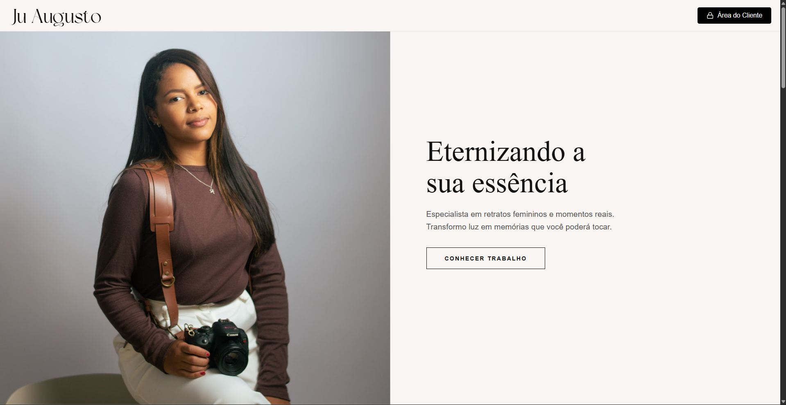
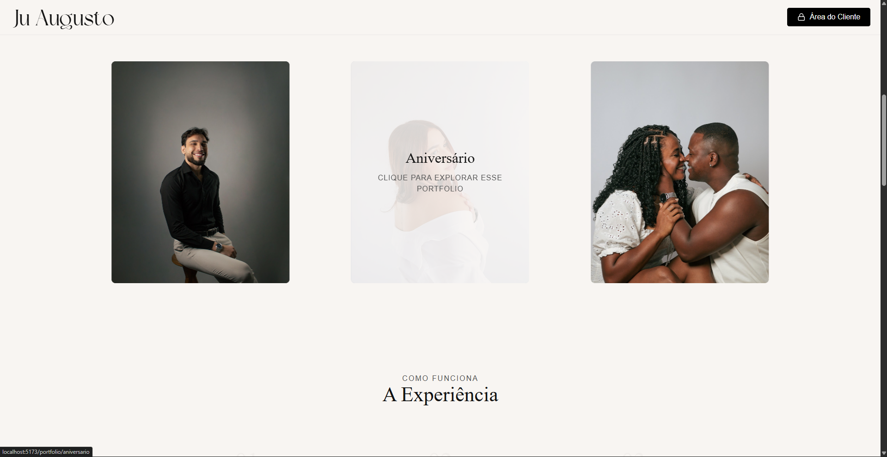
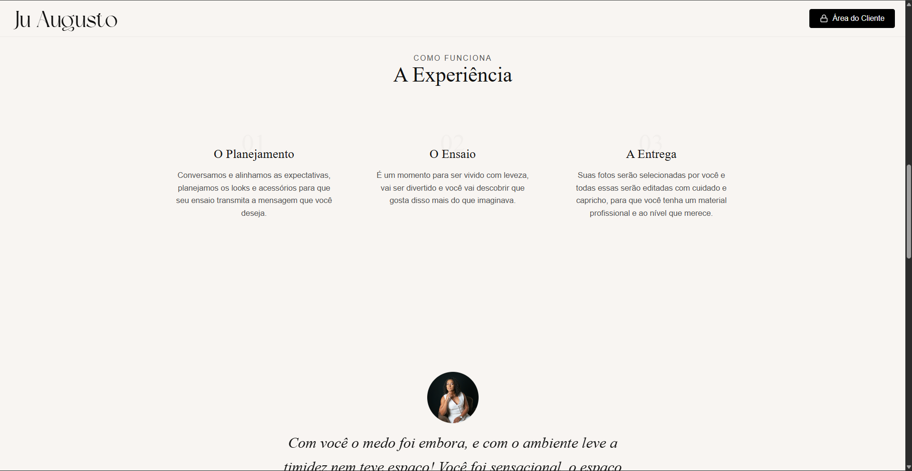
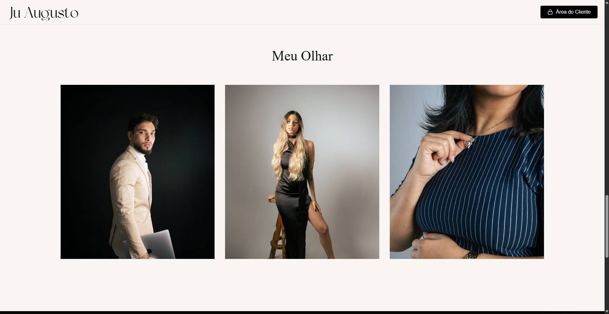
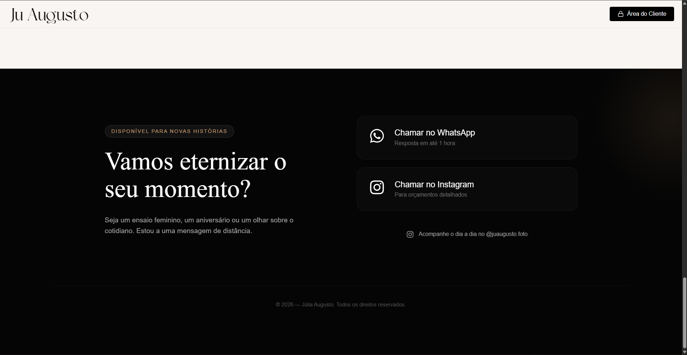

<h1 align="center">
  Ju Augusto Foto
</h1>

  
  
  
  
  

 
 

# 📸 Ju Augusto - Fotografia
Um portfólio moderno e performático desenvolvido para a fotógrafa Júlia Augusto. O projeto utiliza as tecnologias mais recentes do ecossistema React para entregar uma experiência fluida, com carregamento otimizado de imagens diretamente do Google Drive.

# 🚀 Tecnologias Utilizadas
React + TypeScript: Base do projeto para uma interface reativa e tipos seguros.

Vite: Ferramenta de build ultra-rápida para o desenvolvimento moderno.

Styled Components: Para estilização isolada e suporte dinâmico a temas.

Swiper: Para carrosséis de imagens suaves e responsivos.

Google Drive API: Utilizada para gerenciar e servir o conteúdo do portfólio de forma dinâmica.

# 🛠️ Como Funciona a Integração
O site foi construído para ser fácil de manter. As fotos não ficam pesando no código; elas são buscadas dinamicamente de pastas específicas do Google Drive através de variáveis de ambiente.

Configuração de Ambiente
Para rodar o projeto localmente ou fazer o deploy, é necessário configurar as seguintes variáveis (veja o arquivo .env.example para referência):

Plaintext
VITE_GOOGLE_DRIVE_API_KEY=sua_chave_aqui  
VITE_FOLDER_HOME=id_da_pasta_home  
VITE_FOLDER_GESTANTES=id_da_pasta_gestantes  
... e demais categorias listadas no código

# 🎨 Integração com Pixieset
Além do conteúdo dinâmico, o portfólio integra botões de acesso direto às galerias completas e áreas de entrega de clientes no Pixieset.

Permite que o cliente navegue entre o portfólio de exibição e suas fotos privadas de forma intuitiva.

Mantém o fluxo de trabalho da fotógrafa centralizado e profissional.

# 📦 Como rodar o projeto
Clone o repositório:

Bash
git clone https://github.com/Rinkashi17/ju-augusto-foto.git
Instale as dependências:

Bash
npm install
Configure o seu .env:
Crie um arquivo .env na raiz do projeto e preencha com suas chaves da API do Google.

Inicie o servidor de desenvolvimento:

Bash
npm run dev

# 🌐 Deploy
Este projeto está configurado para deploy contínuo na Vercel. As variáveis de ambiente devem ser cadastradas manualmente no painel da Vercel para que a integração com o Drive funcione em produção.
